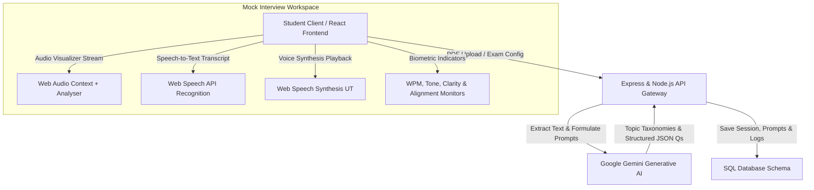

# 🎓 ExamGen AI Pro

> **Next-Generation AI Practice Exam Generator, Automated Assessment Engine & Interactive Recruitment Simulator.**

ExamGen AI Pro is a comprehensive, production-grade AI learning and placement platform. It enables students to upload reference textbooks/notes (PDFs), auto-extract topic hierarchies, generate custom mock exams (MCQs, short answer, long answer, and scenario questions) using Google Gemini AI, and grade descriptive answers in real time with granular alignment metrics.

Additionally, it features an immersive, standalone **AI Mock Interview Workspace** that simulates real-world recruiter assessments. The workspace includes a fully animated professional interviewer avatar, voice-to-text response transcribing, speech synthesis text-to-speech instructions, and real-time biometric speech telemetry.

---

## 🏗️ Architecture & Core Data Flow

Below is the interaction mapping between the React client, Node.js backend controllers, Google Gemini API, Web Audio utilities, and Database models:



---

## 🌟 Key Features

### 1. Dynamic Exam Synthesis
- **PDF Textbook Ingestion**: Parses, splits, and catalogs text chunks from uploaded subject materials.
- **Custom Question Framework**: Generates multi-format questions (Multiple Choice, Conceptual Short Answer, Comprehensive Long Answer, and Scenario-based Case Studies) tailored to selected difficulty tiers (Easy, Medium, Hard).

### 2. AI-Powered Grading, Scoring & Feedback
- **Real-Time Evaluation**: Autogrades answers and provides detailed qualitative feedback.
- **Diagnostics Dashboard**: Visualizes alignment scores, gaps in conceptual understanding, and suggestions for improvement.

### 3. Immersive Recruiter Mock Interview Workspace
- **Dedicated Full-Screen Layout**: Immersive, distraction-free placement-room viewport with a hidden dashboard wrapper.
- **Animated Professional AI Recruiter Avatar**:
  - **Breathing**: Realistic chest and shoulder movement using smooth periodic y-axis translation loops.
  - **Blinking**: Smart blinking behavior simulating natural human-like eyelid winks.
  - **Speaking**: Wiggling mouth shapes synchronized automatically during audio playback.
  - **Thinking / Processing**: Cool glowing celestial data orbits circling the interviewer card.
  - **Listening**: Vivid red glowing margins and recording states during voice capture.
- **Web Audio Visualizer**: Live cyan shadow waveform tracking microphone frequency decibels in a canvas viewport.

### 4. Interactive Telemetry Metrics (HUD)
- **Speaking Tempo**: Auto-estimates Word-Per-Minute (WPM) speed.
- **Tone Detector**: Identifies emotional context (Confident, Analytical, Attentive).
- **Speech Clarity & Conceptual Alignment**: Dynamic percentages representing speech stability and content match against answer rubrics.
- **Question Timer**: A ticking elapsed clock tracking time spent per question to build time management habits.

---

## 💻 Tech Stack

| Component | Technology | Description |
| :--- | :--- | :--- |
| **Core UI** | React 18, Vite | Instant modular components & hot module reloading. |
| **Styling** | Vanilla CSS, TailwindCSS | Grid systems, neon blurs, and glassmorphism. |
| **Animations** | Framer Motion | Smooth layout shifts, fade transitions, and wiggles. |
| **Icons** | Lucide React | Clean, scalable vector icon library. |
| **Server** | Node.js, Express.js | Modular router, logger, and controller architecture. |
| **AI Integration** | Google Gemini API | Structured question parsing, grading, and proctoring. |
| **API Clients** | Axios | Intercepts session headers for secure REST queries. |

---

## 📁 Project Structure

```bash
ExamGenAI/
├── BACKEND/                    # Node Express Server
│   ├── config/                 # DB, Gemini, and secret setups
│   ├── controllers/            # Exam, Grading, and Live Interview business logic
│   ├── models/                 # Database Schemas (User, Session, Question, ProctorLog)
│   ├── routes/                 # Express API Endpoints
│   └── server.js               # Application entrypoint
│
└── FRONTEND/                   # React Frontend App
    ├── src/
    │   ├── components/         # Base loaders, wrappers, modals
    │   ├── pages/              # Main dashboard, workspace & interview rooms
    │   ├── routes/             # AppRoutes config & active route guards
    │   ├── services/           # Axios handlers for backend APIs
    │   ├── index.css           # Global theme variables & Tailwind injections
    │   └── main.jsx            # DOM renderer
```

---

## 🚀 Setup & Installation

### Backend Setup
1. Navigate to the backend directory:
   ```bash
   cd BACKEND
   ```
2. Install npm dependencies:
   ```bash
   npm install
   ```
3. Set up environment variables in a `.env` file:
   ```env
   PORT=5000
   DATABASE_URL=your_database_url
   GEMINI_API_KEY=your_gemini_api_credentials
   JWT_SECRET=your_signing_secret
   ```
4. Start the backend development server:
   ```bash
   npm run dev
   ```

### Frontend Setup
1. Navigate to the frontend directory:
   ```bash
   cd FRONTEND
   ```
2. Install npm dependencies:
   ```bash
   npm install
   ```
3. Start the frontend client (runs on `http://localhost:5173`):
   ```bash
   npm run dev
   ```

---

## 🎯 Presentation Slide Checklist (For Reference)

1. **Title Slide**: Introduce "ExamGen AI Pro" as a dual-mode learning platform (Exam Engine + Recruitment Simulator).
2. **Problem Statement**: Standard test prep lacks customization, and interview practice lacks real-time biometric speaking telemetry.
3. **Core Features Demo**: Highlight topic extraction, real-time grading, and the full-screen Mock Interview Workspace.
4. **The Live AI Recruiter**: Point out the animated professional SVG interviewer avatar (explain the interactive breathing, blinking, speaking mouth wiggles, and glowing indicators powered by Framer Motion).
5. **HUD Telemetry**: Describe the speaking telemetry, including WPM tracking, Speech Clarity index, Tone analyzer, and the elapsed question countdown timer.
6. **Architecture**: Present the Mermaid system design diagram showing Gemini AI integrations and local Web audio utilities.
